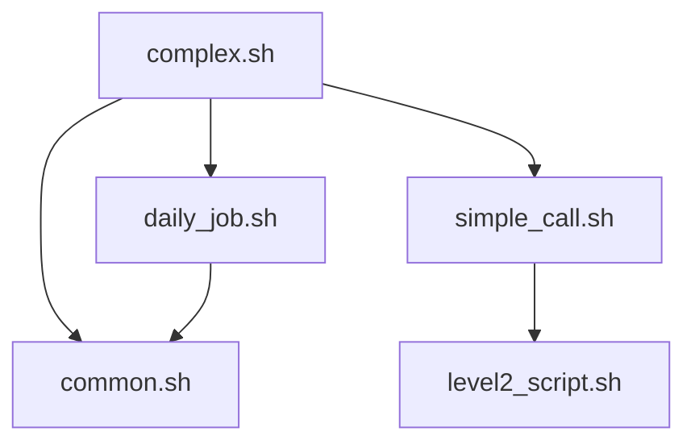

# バッチジョブ呼び出しフロー

## 起点: /workspaces/JobNet/t/fixtures/complex.sh

```mermaid
flowchart TD
    N0[complex.sh]
    N4[level2_script.sh]
    N3[simple_call.sh]
    N1[daily_job.sh]
    N2[common.sh]
    N0 --> N1
    N0 --> N2
    N0 --> N3
    N1 --> N2
    N3 --> N4
```

